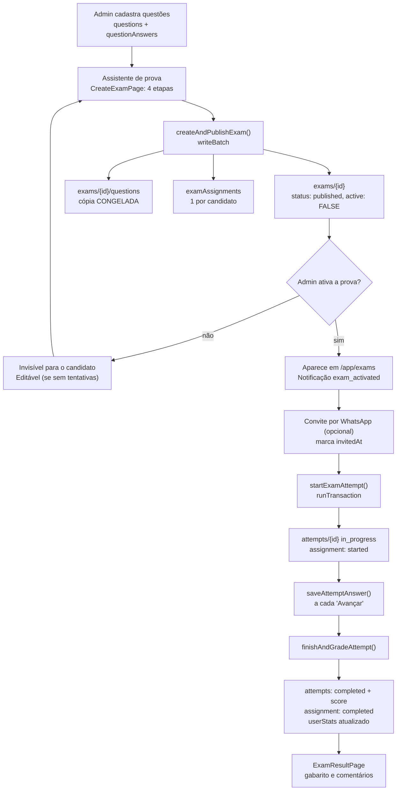

# Arquitetura — Banco de Questões TEOT (HMA 2027)

Documento de arquitetura do sistema. Descreve **como o app está montado**, quais são as camadas, por onde os dados passam, quais decisões estruturais foram tomadas e por quê, e quais limitações são consequência direta dessas decisões.

Documentos irmãos:

- [`README.md`](README.md) — visão geral, como rodar, deploy, operação.
- [`database.md`](database.md) — modelo de dados completo (Firestore + Storage + Regras).
- [`design.md`](design.md) — sistema de design (tokens, tipografia, componentes, padrões de UI).

---

## Sumário

1. [Visão geral em uma página](#visão-geral-em-uma-página)
2. [Princípios e restrições estruturais](#princípios-e-restrições-estruturais)
3. [Camadas da aplicação](#camadas-da-aplicação)
4. [Mapa de módulos](#mapa-de-módulos)
5. [Autenticação, sessão e autorização](#autenticação-sessão-e-autorização)
6. [Roteamento e guards](#roteamento-e-guards)
7. [Camada de dados: padrões de acesso](#camada-de-dados-padrões-de-acesso)
8. [Tempo real (onSnapshot)](#tempo-real-onsnapshot)
9. [Ciclo de vida de uma prova](#ciclo-de-vida-de-uma-prova)
10. [Correção e estatísticas agregadas](#correção-e-estatísticas-agregadas)
11. [Exclusões e reversão de agregados](#exclusões-e-reversão-de-agregados)
12. [Pipeline de imagens](#pipeline-de-imagens)
13. [Conteúdo complementar: Extras, Sabatinas, Cronograma](#conteúdo-complementar-extras-sabatinas-cronograma)
14. [Notificações](#notificações)
15. [Ingestão de dados (importadores e scripts)](#ingestão-de-dados-importadores-e-scripts)
16. [Build, deploy e ambientes](#build-deploy-e-ambientes)
17. [Limitações arquiteturais conhecidas](#limitações-arquiteturais-conhecidas)
18. [Como estender o sistema](#como-estender-o-sistema)

---

## Visão geral em uma página

O produto é uma **SPA React servida estaticamente**, com **Firebase como único backend**. Não existe servidor de aplicação, API intermediária ou Cloud Function neste repositório: o navegador fala **diretamente** com Firestore, Storage e Auth através do SDK cliente.

```
┌──────────────────────────────────────────────┐
│  Navegador (SPA React 18 + TS + Vite)        │
│                                              │
│  index.html → main.tsx → App                 │
│    └─ BrowserRouter                          │
│       └─ AuthProvider  (contexts/)           │
│          └─ AppRoutes  (routes/)             │
│             ├─ UserLayout   → pages/app/*    │
│             └─ AdminLayout  → pages/admin/*  │
│                                              │
│  services/ = única fronteira com o Firebase  │
│    firebase.ts      (init do SDK)            │
│    firebaseService  (CRUD + subscriptions)   │
│    authService      (login/cadastro/senha)   │
│    gradingService   (correção de tentativa)  │
│    importService    (importação em massa)    │
└───────────────┬──────────────────────────────┘
                │ SDK cliente do Firebase (HTTPS/WebChannel)
                ▼
┌──────────────────────────────────────────────┐
│  Projeto Firebase gen-lang-client-0316191622 │
│                                              │
│  Auth      e-mail/senha (admin e candidato)  │
│  Firestore banco NOMEADO (não o "(default)") │
│  Storage   imagens de questões e avatares    │
│  Hosting   serve dist/ + rewrite SPA         │
└──────────────────────────────────────────────┘
```

**Consequência central:** toda regra de negócio roda no cliente. A única barreira real entre um usuário e os dados são as **Regras de Segurança** (`firestore.rules` / `storage.rules`). Isso está detalhado em [Limitações arquiteturais conhecidas](#limitações-arquiteturais-conhecidas).

---

## Princípios e restrições estruturais

| Princípio | Como se manifesta no código |
|---|---|
| **Serverless total** | Nenhuma pasta `functions/`. O deploy do CI é `--only hosting` (via action oficial). |
| **Uma única fronteira de dados** | Nenhuma página importa `firebase/firestore` diretamente; tudo passa por `src/services/*`. |
| **Tipos como contrato** | `src/types.ts` é a fonte única de tipos do domínio, consumida por serviços e páginas. |
| **Congelar o que é histórico** | Provas copiam as questões no momento da publicação (`exams/{id}/questions`), para que editar o banco não altere provas já entregues. |
| **Agregar na escrita, não na leitura** | `userStats` é atualizado no momento da correção, em transação — as telas de desempenho leem um documento pronto em vez de varrer tentativas. |
| **Idempotência e atomicidade onde há concorrência** | `runTransaction` no início da tentativa e na correção; `writeBatch` em blocos de ~400 operações nas escritas em massa. |
| **Degradação silenciosa em efeitos colaterais** | Logs de auditoria, notificações e limpezas órfãs falham em `catch` com `console.warn` — nunca derrubam a ação principal do usuário. |

---

## Camadas da aplicação

```
┌─ Apresentação ────────────────────────────────────────────┐
│ pages/          telas (User, Admin e compartilhadas)      │
│ layouts/        chrome: topbar, sidebar, gaveta, bottom   │
│ components/     blocos reutilizáveis (Avatar, modais...)  │
├─ Estado de sessão ────────────────────────────────────────┤
│ contexts/AuthContext   usuário logado + loading + login   │
│ hooks/                 estado derivado ao vivo (badges)   │
├─ Domínio / acesso a dados ────────────────────────────────┤
│ services/firebaseService   CRUD + subscriptions           │
│ services/authService       identidade e credenciais       │
│ services/gradingService    correção + agregação           │
│ services/importService     ingestão em massa              │
├─ Modelo e utilitários ────────────────────────────────────┤
│ types.ts        contratos do domínio                      │
│ constants.ts    listas fixas (fontes de prova, cronograma)│
│ schemas/        validação Zod                             │
│ utils/          texto, datas, CSV, cores, mídia, arquivos │
├─ Infraestrutura ──────────────────────────────────────────┤
│ services/firebase.ts + firebase/config.ts                 │
└───────────────────────────────────────────────────────────┘
```

Regras de dependência observadas no código:

- `pages/` → `services/`, `components/`, `hooks/`, `contexts/`, `utils/`, `types`.
- `services/` → `firebase/config`, `types`, `utils`. **Nunca** importa de `pages/` ou `components/`.
- `components/` são "burros" o suficiente para não conhecerem rotas, com exceções deliberadas que precisam navegar (`AvatarAccountMenu`, `MobileBottomNav`) ou gravar (`AddQuestionImageModal`, `CsvBulkImportSection`, `QuestionPreviewModal`).

---

## Mapa de módulos

### `src/services/firebase.ts` + `src/firebase/config.ts`

Inicialização única do SDK. Dois detalhes importantes:

1. **Banco nomeado.** `getFirestore(app, firestoreDatabaseId)` — o projeto **não** usa o banco `(default)`, e sim `ai-studio-treinamentoteoti-380df538-...`. Qualquer script ou ferramenta externa precisa passar esse ID explicitamente.
2. **Overrides por ambiente.** A config vem de `firebase-applet-config.json` (versionado), com `import.meta.env.VITE_FIREBASE_*` como sobrescrita opcional — permite apontar um build para outro projeto (ex.: staging) sem editar código.

`firebase/config.ts` é apenas um reexport, mantido porque a maior parte do código importa por esse caminho.

### `src/services/firebaseService.ts` (~1.400 linhas)

É o coração da aplicação. Concentra:

- CRUD de `users`, `areas`, `themes`, `groups`, `reference`, `questions`, `questionAnswers`, `exams`, `examAssignments`, `attempts`, `userStats`, `adminLogs`, materiais (`videotecaItems`, `aulaItems`), `sabatinas`, logs de visualização e `notifications`.
- As **subscriptions** ao vivo (`subscribe*`, um wrapper de `onSnapshot` que devolve o `unsubscribe`).
- As operações compostas de negócio: `createAndPublishExam`, `updateExamContent`, `startExamAttempt`, `deleteExam`, `deleteAttempt`, `subtractFromUserStats`.
- Uploads para o Storage (`uploadQuestionImage`, `addQuestionImage`, `uploadBatchQuestionImage`, `uploadUserAvatar`) e a remoção correspondente.

Utilitários internos relevantes:

- `removeUndefined()` — obrigatório antes de qualquer `setDoc`/`updateDoc`: o SDK lança `Unsupported field value: undefined`, e campos opcionais (`imageUrl`, `userName`…) chegam `undefined` com frequência vinda dos formulários.
- `deleteField()` — usado onde "apagar" precisa mesmo apagar (telefone do usuário, `referenceId` do gabarito, `imageUrl` da questão). Com `merge: true`, mandar `undefined` **não** removeria o campo já gravado.
- `normalizeThemeIds()` — normaliza documentos de material/sabatina gravados antes da migração de `themeId` (único) para `themeIds[]`.
- `ensureAdminUserExists()` — roda no *load* do módulo e garante o admin semente `usr_mauriston_admin`.

### `src/services/authService.ts`

Camada de identidade. Combina Firebase Auth (credencial real) com o cadastro próprio em `users` (autorização de negócio). Detalhes em [Autenticação](#autenticação-sessão-e-autorização).

### `src/services/gradingService.ts`

Uma única função pública, `finishAndGradeAttempt(attemptId)`, que corrige a tentativa comparando cada resposta com `questionAnswers` e atualiza `userStats`. Ver [Correção](#correção-e-estatísticas-agregadas).

### `src/services/importService.ts`

Duas rotinas de ingestão via UI administrativa:

- `importQuestionBankJson()` — cria/atualiza `areas`, `themes`, `questions` e `questionAnswers` a partir de um JSON hierárquico, em lotes com margem de segurança (commit a cada 180 operações).
- `applyThemeGroups()` — grava `groupId`/`groupName` (agrupamento TEOT) nos temas existentes **e** propaga a denormalização para todas as questões de cada tema, em duas fases com progresso reportado.

### `src/contexts/AuthContext.tsx`

Fonte de verdade do usuário logado na UI. Lê o `userId` da sessão em `localStorage`, busca o documento em `users` e escuta `onAuthStateChanged` para re-sincronizar. Expõe `currentUser`, `role`, `loading`, `userLogin`, `adminLogin`, `logout`, `refreshUser`.

### `src/hooks/`

| Hook | Papel |
|---|---|
| `useUnreadNotifications` | Notificações relevantes ao papel do usuário + contagem de não lidas (badge do avatar). |
| `useUnseenExtrasCount` | Materiais de Videoteca/Aulas ainda não vistos (badge do item "Extras"). |
| `useHideOnScroll` | Esconde/mostra barras fixas conforme a direção do scroll (barra de filtros no mobile). |

---

## Autenticação, sessão e autorização

O modelo é **híbrido e deliberado**: o Firebase Auth prova *quem você é*; o documento em `users` decide *o que você pode*.

```
Login (e-mail + senha)
   │
   ├─ 1. busca em `users` pelo e-mail (leitura pública nas Regras)
   │        └─ não achou → UserNotRegisteredError → UI oferece /cadastro
   │        └─ inativo   → UserInactiveError      → redireciona /inactive
   │        └─ é admin no fluxo de candidato → erro explícito
   │
   ├─ 2. signInWithEmailAndPassword (Firebase Auth) → authUid
   │
   ├─ 3. vincula authUid ao doc de `users` se ainda não estava vinculado
   │
   └─ 4. grava o ID interno em localStorage['teot_active_session_user_id']
```

Pontos estruturais:

- **A sessão da UI é o `localStorage`**, não o Firebase Auth. `AuthContext.loadSession()` lê essa chave e recarrega o documento; `clearSession()` limpa a chave *e* faz `signOut`.
- **Cadastro público** (`/cadastro`) cria o usuário com `active: false` e **não** inicia sessão (`startSession: false`). A liberação é manual, pelo admin, em `/admin/users`.
- **Cadastro pelo admin** usa uma **app secundária do Firebase** (`initializeApp(config, 'SecondaryAuthApp')`) para criar a conta de Auth do novo usuário sem derrubar a sessão do admin logado — detalhe fácil de quebrar em refatorações.
- **Bootstrap de admin**: `loginAdminWithPassword` cria a conta no Auth se ela ainda não existir, e cria o documento em `users` com `role: 'admin'` se não houver correspondência. Falhas de rede **não** liberam acesso: sem sessão real do Auth, o login falha (uma versão anterior deixava o usuário "logado" na UI enquanto Storage/Firestore recusavam tudo).
- **Troca de credenciais pelo próprio usuário** (`updateOwnCredentials`) reautentica com a senha atual antes de `updateEmail`/`updatePassword`, como o Firebase exige para operações sensíveis.
- **Usuários legados** (anteriores ao login por senha) não têm conta no Auth. O script `scripts/setup-user-passwords.mjs` cria essas contas com senha padrão e vincula o `authUid`.

---

## Roteamento e guards

Definido em `src/routes/AppRoutes.tsx`. Dois guards em forma de rota-pai que renderizam o layout correspondente:

- `UserProtectedRoute` → exige `currentUser` e `currentUser.active`; renderiza `UserLayout`.
- `AdminProtectedRoute` → exige adicionalmente `role === 'admin'`; renderiza `AdminLayout`.

Enquanto `loading` é `true`, ambos renderizam um estado de verificação — evita o "flash" de redirecionamento para `/` antes de a sessão carregar.

Três páginas são **compartilhadas** entre os dois acessos (`ExtrasPage`, `SabatinasPage`, `NotificationsPage`): elas se adaptam pelo papel do usuário (`isAdmin` habilita criar/editar/excluir e ver contadores de visualização). Isso evita duplicar telas quase idênticas.

`SettingsPage` é montada nas duas árvores de rota, mas o arquivo vive em `pages/app/`.

O layout do candidato tem um caso especial: durante a **execução de uma prova** (`/app/exams/:assignmentId`), o `UserLayout` detecta a rota por regex e renderiza **apenas o conteúdo** — sem topbar, sidebar, rodapé ou navegação inferior. É o "modo prova".

---

## Camada de dados: padrões de acesso

### Filtro server-side vs. client-side

`getQuestions()` aplica no Firestore apenas o que é barato e indexável (`areaId`, `themeId`) e filtra localmente o que exigiria índices compostos ou não é suportado (multi-seleção de `sourceExam`, busca textual normalizada). Consequência: **a lista de questões é carregada por área/tema e refinada em memória** — funciona bem na escala atual (milhares de questões), mas é o primeiro ponto a revisar se o banco crescer uma ordem de grandeza.

### Leitura em lote com o operador `in`

`getQuestionAnswersByIds()` e `getQuestionsByIds()` particionam os IDs em blocos de **30** (limite do operador `in` do Firestore) e montam um `Record<id, doc>`. É o que permite listar 200 questões com o gabarito de cada uma sem disparar 200 leituras individuais.

### Escrita em lote com limite de 500

Todas as escritas em massa (`createAndPublishExam`, `updateExamContent`, `deleteExam`, `deleteAttempt`, `applyThemeGroups`) usam `writeBatch` e **comitam a cada ~400 operações**, recriando o batch em seguida. O limite real do Firestore é 500; a margem cobre operações adicionais no mesmo laço.

`importQuestionBankJson()` usa margem ainda maior (180), porque cada questão gera 2 operações (`questions` + `questionAnswers`).

### Transações onde há corrida real

| Local | O que protege |
|---|---|
| `startExamAttempt()` | Dois cliques / duas abas criando duas tentativas para a mesma atribuição. A decisão "reusar ou criar" acontece dentro da transação, ancorada no documento de `examAssignments`. |
| `finishAndGradeAttempt()` | Dupla contagem em `userStats`. O status vira `'grading'` dentro de uma transação — a segunda chamada concorrente vê status ≠ `in_progress` e retorna imediatamente. |
| `finishAndGradeAttempt()` (2ª transação) | Leitura-modificação-escrita de `userStats`, para que duas provas concluídas quase ao mesmo tempo somem em vez de uma sobrescrever a outra. |
| `subtractFromUserStats()` | Mesma proteção, no sentido inverso (exclusões). |

### Denormalização

O modelo grava nomes junto dos IDs (`areaName`, `themeName`, `groupName`, `examName`, `userName`) para que listagens e relatórios não precisem cruzar coleções. Onde a denormalização pode estar defasada (registros antigos), a UI mantém um *fallback* — por exemplo, `AttemptsPage` e `DashboardPage` montam um mapa `userId → name` a partir de `getUsers()` para cobrir tentativas gravadas antes de `userName` existir.

---

## Tempo real (onSnapshot)

Doze pontos do sistema usam assinatura contínua em vez de leitura única. O critério aplicado é claro: **dados de referência (áreas, temas, usuários, referências) são buscados uma vez; dados que mudam enquanto a tela está aberta são assinados.**

| Subscription | Usada em | Efeito visível |
|---|---|---|
| `subscribeUserAssignments` | `app/ExamsPage`, `app/HomePage` | Prova recém-atribuída/ativada aparece sem recarregar. |
| `subscribeAllAttempts` | `admin/DashboardPage` | KPIs e tabela de tentativas atualizam ao vivo. |
| `subscribeAttemptsForExam` | `admin/ExamViewPage` | Tabela "Respostas Enviadas" cresce conforme os residentes terminam. |
| `subscribeAllUserStats` | `admin/DashboardPage` | Ranking geral atualiza após cada correção. |
| `subscribeVideotecaItems` / `subscribeAulaItems` | `ExtrasPage`, `useUnseenExtrasCount` | Material novo aparece na hora; badge recalcula. |
| `subscribeAllMaterialViewLogs` / `subscribeViewedMaterialIds` | `ExtrasPage` | Contador de visualizações (admin) e badge "Visto" (usuário). |
| `subscribeSabatinas` / `subscribeAllSabatinaViewLogs` | `SabatinasPage` | Idem, para sabatinas. |
| `subscribeNotifications` / `subscribeNotificationReadState` | `useUnreadNotifications` | Badge de não lidas. |
| `subscribeNewNotifications` | `NotificationToastHost` | Pop-ups em tempo real. |

Todas devolvem o `unsubscribe` e são limpas no *cleanup* do `useEffect`. Duas convenções importantes:

- Telas com **duas assinaturas** (ex.: Dashboard) só encerram o `loading` quando ambas entregaram o primeiro *snapshot* (`attemptsLoaded && statsLoaded`).
- `subscribeNewNotifications(sinceDate, …)` filtra por `createdAt > sinceDate` e reage apenas a `docChanges()` do tipo `added`, para não disparar um pop-up por notificação antiga ao montar a tela.

---

## Ciclo de vida de uma prova



### Congelamento das questões

No momento da publicação, cada questão selecionada é **copiada** para `exams/{examId}/questions/eq_N` com `originalQuestionId` apontando de volta ao banco. Motivo: editar ou excluir uma questão do banco não pode alterar o conteúdo de uma prova já entregue.

O custo dessa decisão é que a cópia congelada **não carrega tudo** — `sourceExam`, por exemplo, não está lá. Por isso `ExamResultPage` e `ExamViewPage` chamam `getQuestionsByIds()` para buscar os originais só para exibir o chip de origem.

### Portão de edição

Uma prova só pode ser editada enquanto está **inativa e sem nenhuma tentativa registrada**. Essa regra é verificada em três lugares, de propósito:

1. `ExamsListPage.isEditable()` — esconde o botão de editar.
2. `CreateExamPage` — bloqueia a abertura do assistente com mensagem explícita (`gateError`).
3. `updateExamContent()` no serviço — última linha de defesa, lança erro.

`ExamViewPage` deriva o mesmo `canEdit` **a cada render** (não em estado próprio) para que ativar a prova naquela mesma tela esconda imediatamente o botão de remover questão.

### Reconstrução em vez de reconciliação

`updateExamContent()` **apaga toda a subcoleção congelada e a reescreve** a partir da nova seleção, em vez de tentar descobrir o que entrou, saiu ou mudou de ordem. É mais simples e não deixa estados intermediários inconsistentes. O `set` no documento da prova usa `merge: true` para preservar `active`, `status`, `createdBy`, `createdAt` e `publishedAt`.

### Execução da prova

`TakeExamPage` implementa um fluxo **sem retorno**:

- Não há botão "voltar" — o residente avança questão a questão.
- Não é possível avançar sem escolher uma alternativa; logo, não é possível terminar com questões em branco.
- Na última questão, "Finalizar" salva a resposta e dispara a correção.
- **Rascunho local**: a alternativa selecionada mas ainda não confirmada é guardada em `localStorage` (`teot_exam_draft_{attemptId}`), para sobreviver a um refresh ou queda de conexão entre a seleção e o clique em avançar. Respostas confirmadas continuam vindo do Firestore.
- **Retomada**: ao reabrir uma tentativa `in_progress`, a tela pula para a primeira questão sem resposta e hidrata a seleção a partir do Firestore ou do rascunho local.
- A notificação `exam_started` só dispara quando não há nenhuma resposta salva — ou seja, na primeira abertura, não a cada retomada.
- Uma prova desativada pelo admin não pode ser **iniciada**, mas quem já está com ela `started` não é interrompido.

---

## Correção e estatísticas agregadas

`finishAndGradeAttempt()` executa, nesta ordem:

1. **Reivindica a correção** em transação: `in_progress → grading`. Se já estava em outro estado, retorna a tentativa como está (idempotência sob clique duplo / duas abas).
2. Para cada resposta, lê `questionAnswers/{originalQuestionId}` e grava `isCorrect` no documento da resposta. Acumula em memória o desdobramento por **área** e por **tema**.
3. Atualiza `attempts/{id}` com `completed`, acertos, erros, não respondidas e `scorePercentage`.
4. Atualiza a `examAssignment` para `completed`.
5. Em uma **segunda transação**, soma o desdobramento em `userStats/{userId}` (total geral + `areas{}` + `themes{}` + `overallScorePercentage` + `lastActiveDate`).

Notas de precisão que valem conhecer antes de mexer:

- `scorePercentage` usa `attempt.totalQuestions` como denominador (não o número de respondidas), então questões em branco derrubam o percentual — coerente com o fluxo que impede terminar em branco.
- `userStats.totalSolved` conta apenas **respondidas** (`correct + wrong`), sem as em branco. Ou seja, o percentual da tentativa e o percentual geral do usuário têm denominadores conceitualmente diferentes, de propósito.
- **Não existe agregado por Grupo TEOT.** As telas derivam o grupo cruzando `userStats.themes` com a coleção `themes` (`themeId → groupId`) em tempo de renderização.

---

## Exclusões e reversão de agregados

Firestore não cascateia. O sistema resolve isso explicitamente:

### `deleteExam(examId)`

1. **Apaga o documento da prova primeiro, sozinho.** É o que o admin pediu e não pode ficar preso atrás da limpeza. (Antes, um único batch atômico cobrindo todas as atribuições fazia uma escrita recusada derrubar a exclusão inteira, e "Excluir" parecia quebrado.)
2. Em seguida, **best-effort** dentro de um `try/catch`: apaga a subcoleção congelada, todas as `examAssignments` da prova e todas as `attempts` (com suas `answers`).
3. Para cada tentativa **concluída**, chama `subtractFromUserStats()` antes de apagar, revertendo o que ela somou.

### `deleteAttempt(attemptId)`

Reverte `userStats` (se concluída), apaga as respostas e a tentativa e **libera a atribuição** de volta para `available`, limpando `startedAt`, `completedAt` e `attemptId` com `deleteField()`. Sem isso, o painel do residente ficaria com um card "Concluída" apontando para uma tentativa inexistente.

### `deleteUserAccount(userId)`

**Não** cascateia, de propósito: apaga apenas o documento em `users`, preservando o histórico agregado (dashboards, ranking) — o oposto da política de `deleteExam()`. As telas cobrem o vazio com o rótulo "Usuário removido".

---

## Pipeline de imagens

Três caminhos convivem no bucket, cada um com um caso de uso distinto:

| Caminho | Origem | Quem grava o `imageUrl` |
|---|---|---|
| `question-images/{questionId}/{timestamp}.{ext}` | Upload individual pela UI (`QuestionsPage`, `AddQuestionImageModal`) | `saveQuestion()` ou `addQuestionImage()` |
| `imagens_questoes/{fonte}/{arquivo}` | Lote por prova (`BulkImagesSection` na tela Importar, ou `scripts/import-question-images.mjs`) | `uploadBatchQuestionImage()` ou o script |
| `user-avatars/{userId}/{timestamp}.{ext}` | Foto de perfil (Ajustes ou detalhe do usuário no admin) | `uploadUserAvatar()` |

Decisões relevantes:

- **`imageUrl` é sempre uma URL absoluta pronta para uso** (`getDownloadURL()`), consumida por `` comum — não pelo SDK do Storage. É por isso que `storage.rules` libera **leitura pública** desses caminhos: não há como autenticar uma requisição de `` sem reescrever todo o carregamento.
- A importação em lote casa arquivo↔questão **pelo nome do arquivo** (`<questionId>.jpeg|jpg|png`). Na UI não há passo de mapeamento; no script, o mapeamento é um JSON `{ questionId: nomeDoArquivo }`.
- `deleteQuestionImage()` apaga o objeto no Storage a partir da própria download URL (funciona nos dois caminhos) e limpa o campo com `deleteField()`. Falha ao apagar o objeto **não** impede limpar o campo.
- `QuestionImage.tsx` normaliza caminhos relativos legados para URL absoluta e tem *fallback* visual com link direto quando o carregamento falha.

---

## Conteúdo complementar: Extras, Sabatinas, Cronograma

Três módulos que não têm nada a ver com o motor de provas, mas compartilham a mesma taxonomia Área/Tema:

- **Extras** (`ExtrasPage`) — duas abas: **Videoteca** (vídeos do YouTube, com thumbnail pública `img.youtube.com`) e **Aulas** (apresentações do Canva ou Google Slides embedadas). Um material pertence a **uma área e vários temas**. O usuário vê badge "Visto"; o admin vê o contador de visualizações com a lista de quem abriu.
- **Sabatinas** (`SabatinasPage`) — apresentações do Google Slides agrupadas por data, com download em PDF via o endpoint oficial de exportação do Slides (`/export/pdf`) intermediado por `shareOrDownloadFile()` (Web Share API quando disponível, senão download comum, senão abrir em nova aba).
- **Cronograma** (`app/CronogramaPage`) — calendário mensal + agenda do treinamento. **Não tem persistência**: os 19 eventos são uma constante em `src/constants.ts` (`TRAINING_SCHEDULE`). Alterar o cronograma exige editar código e publicar.

`src/utils/mediaUrls.ts` concentra a normalização de URLs de mídia: extração de ID do YouTube (watch, youtu.be, embed, shorts, live), extração do `src` de um `<iframe>` colado (código de incorporação do Canva) e conversão de links do Slides para modo embed/exportação.

---

## Notificações

Modelo deliberadamente simples, sem *fan-out* por usuário:

- Uma coleção `notifications` com documentos globais. Cada um tem `type`, `message`, `audience` e `actorId`/`actorName`.
- **Audiência** é uma propriedade do evento, não uma lista de destinatários:
  - `'all'` — eventos gerados por candidatos (`exam_started`, `exam_completed`), que colegas e admin acompanham.
  - `'users_only'` — eventos gerados pelo admin (`exam_activated`, `sabatina_created`, `video_created`, `aula_created`); o próprio admin já sabe o que fez.
- **A filtragem é feita no cliente** (`useUnreadNotifications`, `NotificationToastHost`), incluindo a exclusão do próprio ator. Motivo explícito: uma consulta `where('audience','in',[...]) + orderBy('createdAt')` exigiria um índice composto criado manualmente no console.
- **Estado de leitura** é um marcador "lido até": um documento por usuário em `notificationReads/{userId}` com `lastReadAt`. Evita um documento de leitura por notificação por usuário.
- A criação de notificação é sempre **efeito colateral não bloqueante**: `createNotification(...).catch(console.error)` — nunca em `await` no caminho crítico.

---

## Ingestão de dados (importadores e scripts)

Duas famílias, com fronteiras de segurança diferentes.

### Pela UI administrativa (SDK cliente, sessão do admin)

Todas concentradas em `/admin/import` (`ImportPage`):

| Seção | Função | Efeito |
|---|---|---|
| Banco de Questões (JSON) | `importQuestionBankJson` | Cria `areas`, `themes`, `questions`, `questionAnswers` + log em `imports`. |
| Grupos (TEOT) dos Temas | `applyThemeGroups` | Grava `groupId`/`groupName` em temas existentes e propaga às questões. Não cria nada novo. |
| Imagens em Lote | `uploadBatchQuestionImage` | Envia uma pasta inteira; casa pelo nome do arquivo; grava log em `adminLogs`. |
| Videoteca / Aulas (CSV) | `CsvBulkImportSection` | Parseia com `papaparse`; casa Área/Tema por nome; múltiplos temas separados por `;`. |

Fica sujeita às Regras de Segurança e ao tempo de vida da aba do navegador.

### Por script Node (Admin SDK, Service Account)

`scripts/*.mjs` — todos com `--dry-run`, todos exigindo credencial de administrador (`firebase login` local ou Service Account Key via `--key`/`GOOGLE_APPLICATION_CREDENTIALS`), todos apontando explicitamente para o banco nomeado.

| Script | Papel |
|---|---|
| `import-question-images.mjs` | Lote de imagens → Storage + `imageUrl`, via arquivo de mapeamento. |
| `import-questions-csv.mjs` | Questões via CSV; resolve Área/Grupo/Tema/Referência por nome; cria tema inexistente; **bloqueia duplicatas comparando enunciado normalizado**. |
| `import-references.mjs` | Popula `reference` a partir de `reference/livros_referencia.csv`, com ID determinístico (idempotente). |
| `setup-user-passwords.mjs` | Cria conta no Auth para usuários legados e vincula `authUid`. |
| `recalc-question-counts.mjs` | Recalcula `questionCount` de áreas/temas com consultas de agregação (`.count()`). |
| `split-source-exam.mjs` | Deriva `sourceExamName` / `sourceExamYear` de `sourceExam`, sem alterar o campo original. |
| `fix-question-area-id.mjs` | Corrige `areaId` gravado com o **nome** da área em vez do ID. |
| `fix-question-theme-id.mjs` | Corrige `themeId` inválido e ressincroniza todos os campos derivados do tema. |

---

## Build, deploy e ambientes

```
código-fonte ──vite build──▶ dist/ ──action-hosting-deploy──▶ Firebase Hosting
```

- **Vite 6** com `@vitejs/plugin-react` e `@tailwindcss/vite`. ⚠️ O plugin do Tailwind é **obrigatório**: `src/index.css` usa `@import "tailwindcss"` (sintaxe v4). Removê-lo gera um build "bem-sucedido" com CSS sem nenhuma utilitária — a app renderiza sem estilo algum. Já aconteceu uma vez.
- **Hosting** serve `dist/` com rewrite SPA (`** → /index.html`) e `Cache-Control: no-cache` em `/index.html`, para que uma publicação nova não fique presa em cache enquanto os assets com hash mudam.
- **CI/CD** (`.github/workflows/deploy.yml`), em `push` na `main` ou disparo manual: checkout → Node 24 → Bun → `bun install` → `bun run build` → `FirebaseExtended/action-hosting-deploy@v0` com o secret **`FIREBASE_SERVICE_ACCOUNT`** (migrado de `FIREBASE_TOKEN`, descontinuado pelo Firebase).
- **As Regras de Segurança não são publicadas pelo CI.** `firestore.rules`/`storage.rules` estão versionadas e referenciadas em `firebase.json`, mas só vão ao ar com `firebase deploy --only firestore:rules,storage:rules` executado deliberadamente — e o cabeçalho de cada arquivo pede que se compare com o publicado no console antes.
- **PWA parcial**: há `manifest.webmanifest`, ícones e meta tags (instalável, com ícone e splash). **Não há service worker**, portanto não há funcionamento offline nem cache de assets pelo app.

---

## Limitações arquiteturais conhecidas

Estas não são bugs; são consequências diretas do desenho "sem backend próprio". Estão registradas aqui para que qualquer decisão futura seja tomada com elas à vista.

### 1. O gabarito é lido pelo navegador

`gradingService.ts` roda no cliente e precisa ler `questionAnswers`. As Regras só conseguem exigir "estar autenticado". Portanto **qualquer sessão autenticada pode, tecnicamente, ler o gabarito de qualquer questão pelo SDK** — não apenas a que está respondendo.

*Correção real:* mover a correção para uma Cloud Function que seja a única com permissão de leitura sobre `questionAnswers`.

### 2. Não há isolamento por dono nas Regras

`examAssignments.userId`, `attempts.userId` e afins guardam o **ID interno do app** (`users/{id}`), não `request.auth.uid`. Desde a migração para login por senha o `authUid` é persistido no documento do usuário, mas as Regras ainda não o usam. Na prática, qualquer sessão autenticada pode ler/escrever tentativas de qualquer usuário.

*Correção real:* usar `get()` nas Regras para comparar `request.auth.uid` com o `authUid` do dono, ou passar a gravar o `uid` diretamente nos documentos.

### 3. `users` é publicamente legível

Necessário porque a tela inicial precisa localizar o documento pelo e-mail **antes** de existir qualquer sessão, e o cadastro público precisa checar e-mail duplicado. `create` também é público, mas restrito a `active == false` e `role == 'user'`.

### 4. Consulta *collection group* sem índice garantido

`getExamsContainingQuestion()` usa `collectionGroup(db, 'questions')` com `where`. Índices de *collection group* **não** são criados automaticamente pelo Firestore. Se essa consulta falhar em produção, o próprio erro traz o link para criar o índice no console.

### 5. Escalabilidade das leituras

Várias telas carregam coleções inteiras (`getQuestions()` sem filtro em `ExamStatsPage` e `CreateExamPage`, `getAllAttempts()`, `getAllUserStats()`, `getAllMaterialViewLogs()`). É adequado à escala atual (uma turma de residentes), mas não a um crescimento de ordem de grandeza.

### 6. `questionCount` não é mantido

`areas.questionCount` e `themes.questionCount` são gravados como `0` na importação e nunca atualizados pelo CRUD. Hoje **não são lidos por nenhuma tela** (`applyThemeGroups` os usa apenas para estimar uma barra de progresso). `scripts/recalc-question-counts.mjs` existe para reconciliá-los quando necessário.

---

## Como estender o sistema

**Adicionar uma coleção nova:**
1. Tipo em `src/types.ts`.
2. Funções de acesso em `src/services/firebaseService.ts` (e a `subscribe*` correspondente, se a tela precisar de tempo real).
3. Bloco `match` em `firestore.rules` — o `match /{document=**} { allow read, write: if false; }` no fim nega tudo que não estiver listado.
4. Tela em `src/pages/` e rota em `AppRoutes.tsx`.

**Adicionar um tipo de notificação:** estender `NotificationType` em `types.ts`, escolher a `audience` certa, mapear um ícone em `NotificationsPage.ICONS` e chamar `createNotification(...)` sem `await`.

**Mudar cor, fonte ou espaçamento:** editar os tokens em `src/index.css` (`@theme`), não as classes espalhadas pelas telas. Ver [`design.md`](design.md) para o que é token e o que é literal.

**Mexer em escrita em massa:** manter o padrão de commit a cada ~400 operações e o `removeUndefined()` antes de gravar.
