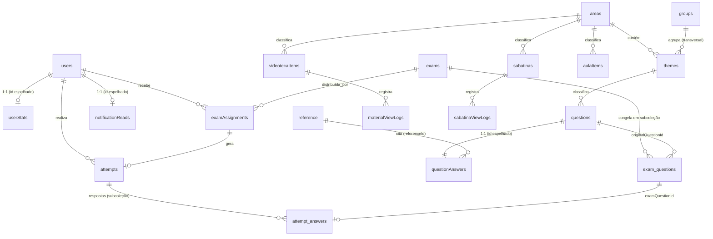

# Banco de Dados — Banco de Questões TEOT (HMA 2027)

Referência completa do modelo de dados: coleções do Firestore, campos, tipos, convenções de ID, relacionamentos, denormalizações, caminhos do Storage, Regras de Segurança e rotinas de manutenção.

Documentos irmãos: [`README.md`](README.md) · [`architecture.md`](architecture.md) · [`design.md`](design.md)

---

## Sumário

1. [Identificação do banco](#identificação-do-banco)
2. [Convenções gerais](#convenções-gerais)
3. [Mapa das coleções](#mapa-das-coleções)
4. [Diagrama de relacionamentos](#diagrama-de-relacionamentos)
5. [Taxonomia: áreas, temas e grupos](#taxonomia-áreas-temas-e-grupos)
6. [Referência de cada coleção](#referência-de-cada-coleção)
7. [Firebase Storage](#firebase-storage)
8. [Regras de Segurança](#regras-de-segurança)
9. [Índices](#índices)
10. [Integridade referencial e cascatas](#integridade-referencial-e-cascatas)
11. [Dados semente e arquivos de referência](#dados-semente-e-arquivos-de-referência)
12. [Manutenção e migrações](#manutenção-e-migrações)
13. [Inconsistências conhecidas](#inconsistências-conhecidas)

---

## Identificação do banco

| Item | Valor |
|---|---|
| Projeto Firebase | `gen-lang-client-0316191622` |
| **Database ID** | `ai-studio-treinamentoteoti-380df538-23a0-4430-8321-7124c54a45e6` |
| Modo | Firestore Native |
| Bucket do Storage | `gen-lang-client-0316191622.firebasestorage.app` |

> ⚠️ **Não é o banco `(default)`.** Todo acesso precisa passar o ID explicitamente:
> `getFirestore(app, firestoreDatabaseId)` no SDK cliente (`src/services/firebase.ts`),
> `getFirestore(app, FIRESTORE_DATABASE_ID)` no Admin SDK (todos os `scripts/*.mjs`),
> e a chave `firestore.database` em `firebase.json` para deploy de regras.
> Esquecer isso faz o código gravar silenciosamente no banco errado.

---

## Convenções gerais

### Formato dos IDs

Três padrões coexistem, cada um por um motivo:

| Padrão | Exemplo | Onde | Por quê |
|---|---|---|---|
| **Determinístico por nome** | `area_anatomia`, `theme_anatomia_da_mao`, `ref_netter_s` | `areas`, `themes`, `reference` | Reimportar o mesmo conteúdo atualiza em vez de duplicar. Gerado por `nome` → minúsculo → sem acento → não-alfanumérico vira `_`. |
| **Prefixo + timestamp + aleatório** | `ex_1712345678901_a1b2c3d`, `att_...`, `asgn_...`, `q_...`, `vid_...`, `aula_...`, `sab_...`, `notif_...`, `log_...` | Maioria das coleções transacionais | `generateId(prefix)` em `src/utils/helpers.ts`. |
| **Espelhado de outro documento** | `questionAnswers/{questionId}`, `userStats/{userId}`, `notificationReads/{userId}` | Relações 1:1 | Elimina a necessidade de consulta: o ID do pai *é* o ID do filho. |

Questões importadas por CSV (`scripts/import-questions-csv.mjs`) recebem **UUID v4** — padrão da maior parte do banco atual.

Prefixos em uso: `usr_` · `q_` · `ex_` · `asgn_` · `att_` · `imp_` · `log_` · `vid_` · `aula_` · `sab_` · `view_` · `sabview_` · `notif_` · `area_` · `theme_` · `ref_`.

### Timestamps

Todos os campos de data usam `serverTimestamp()` do Firestore (tipo `Timestamp`), tipados como `any` em `src/types.ts`. A leitura no cliente lida com três formas possíveis, porque há dados de origens diferentes:

```ts
// padrão aplicado em helpers.formatDate / formatDateOnly e nos sorts
value?.toDate?.()               // Timestamp do Firestore
value instanceof Date           // Date nativo (otimismo local, ex.: invitedAt)
value.seconds                   // objeto serializado {seconds, nanoseconds}
```

Exceções deliberadas — **strings**, não `Timestamp`:

- `Sabatina.date` → `'YYYY-MM-DD'`, para não sofrer deslocamento de fuso ao converter para `Date`.
- `UserStats.lastActiveDate` → `'YYYY-MM-DD'`.
- `TrainingScheduleItem.date` (constante em código) → `'DD/MM/YYYY'`.

### `undefined` é proibido

O SDK do Firestore lança `Unsupported field value: undefined`. Todo payload passa por `removeUndefined()` antes de `setDoc`/`updateDoc`.

Corolário importante: com `merge: true`, **remover um campo exige `deleteField()`**. Mandar `undefined` apenas o preserva. Aplicado em:

| Campo | Função |
|---|---|
| `users.phone` | `updateUserPhone()` (telefone vazio apaga) |
| `questionAnswers.referenceId` | `saveQuestion()` (desvincular referência) |
| `questions.imageUrl` | `deleteQuestionImage()` |
| `examAssignments.startedAt` / `completedAt` / `attemptId` | `deleteAttempt()` (libera a atribuição) |

### Denormalização

O modelo grava nomes ao lado dos IDs para evitar cruzamentos em listagens:

| Campo denormalizado | Origem |
|---|---|
| `questions.areaName` / `themeName` / `groupName` | `areas` / `themes` / `groups` |
| `attempts.examName` / `userName` | `exams` / `users` |
| `videotecaItems`, `aulaItems`, `sabatinas`: `areaName`, `themeNames[]` | `areas` / `themes` |
| `materialViewLogs.userName`, `sabatinaViewLogs.userName` | `users` |
| `notifications.actorName` | `users` |

Nenhuma dessas cópias é sincronizada automaticamente: renomear uma área **não** atualiza as questões já gravadas. As telas mantêm *fallbacks* (o mapa `userId → name` em `AttemptsPage`/`DashboardPage`, a resolução por `themeId` nas telas de estatística).

---

## Mapa das coleções

**18 coleções de topo + 3 subcoleções.**

| Coleção | Documento representa | ID | Escrita por |
|---|---|---|---|
| `users` | Candidato ou administrador | `usr_*` / `admin_{authUid}` / semente | Admin, cadastro público, login |
| `areas` | Área da especialidade | `area_<nome>` | Importação JSON |
| `themes` | Tema dentro de uma área | `theme_<nome>` | Importação JSON / CSV |
| `groups` | Grupo oficial TEOT | livre (ver nota) | **Manual, fora do app** |
| `reference` | Livro/fonte bibliográfica | `ref_<código>` | `scripts/import-references.mjs` |
| `questions` | Questão (pública, sem gabarito) | UUID / `q_*` | Admin, importadores |
| `questionAnswers` | Gabarito + comentário | **= `questionId`** | Admin, importadores |
| `exams` | Prova/simulado | `ex_*` | Admin |
| `exams/{id}/questions` | *(sub)* Cópia congelada da questão | `eq_1`, `eq_2`… | `createAndPublishExam` / `updateExamContent` |
| `examAssignments` | Atribuição prova↔candidato | `asgn_*` | Admin |
| `attempts` | Tentativa de um candidato | `att_*` | Candidato |
| `attempts/{id}/answers` | *(sub)* Resposta marcada | **= `examQuestionId`** | Candidato |
| `userStats` | Agregado de desempenho | **= `userId`** | `gradingService` |
| `adminLogs` | Log de ação administrativa | `log_*` | Admin |
| `imports` | Log de importação em massa | `imp_*` | `importService` |
| `videotecaItems` | Vídeo do YouTube | `vid_*` | Admin |
| `aulaItems` | Apresentação (Canva/Slides) | `aula_*` | Admin |
| `materialViewLogs` | Visualização de material | `view_*` | Usuário |
| `sabatinas` | Sabatina (Google Slides) | `sab_*` | Admin |
| `sabatinaViewLogs` | Visualização de sabatina | `sabview_*` | Usuário |
| `notifications` | Evento notificável | `notif_*` | Sistema |
| `notificationReads` | Marcador "lido até" | **= `userId`** | Usuário |

> **`groups`** é a única coleção que nenhuma rotina do repositório cria. Os 7 grupos oficiais do TEOT precisam existir previamente no Firestore; `applyThemeGroups()` apenas os **lê** para casar por nome, e reporta em `unknownGroups` qualquer nome sem correspondência.

---

## Diagrama de relacionamentos



---

## Taxonomia: áreas, temas e grupos

Este é o ponto do modelo que mais gera confusão. São **duas hierarquias paralelas**, não uma só:

```
ÁREA (região anatômica / especialidade)      GRUPO (agrupamento oficial TEOT)
  Mão                                          Anatomia
  Joelho                                       Ciência Básica
  Quadril                                      Ortopedia Adulto
  Ombro e Cotovelo                             Ortopedia Infantil
  Pé e Tornozelo                               Trauma Adulto
  Coluna                                       Trauma Infantil
  Anatomia                                     Oncologia Ortopédica
  …                                            (7, fixos)
        │                                              │
        └──────────► TEMA ◄────────────────────────────┘
                (pertence a 1 área e a 1 grupo)
```

| | Área | Grupo |
|---|---|---|
| Coleção | `areas` | `groups` |
| Ligação com o tema | `themes.areaId` | `themes.groupId` |
| Filtra questões no banco? | **Sim** | **Nunca** |
| Filtra questões na criação de provas? | **Sim** | **Nunca** |
| Usado em estatísticas? | Sim | **Sim — é seu único uso** |

Um mesmo Grupo **cruza várias Áreas**: "Trauma Adulto" reúne temas de Mão, Joelho, Ombro e Cotovelo etc. Por isso Grupo não é um nível acima nem abaixo de Área — é um eixo paralelo. É também por isso que as telas de desempenho têm cards separados para "por Área" e "por Grupo (TEOT)", em vez de um *drill-down* de um dentro do outro.

Nenhum agregado por grupo é persistido. As telas derivam o grupo cruzando `userStats.themes` (que é por `themeId`) com a coleção `themes` em tempo de renderização.

---

## Referência de cada coleção

### `users`

Cadastro de identidade e autorização de negócio.

| Campo | Tipo | Obrig. | Notas |
|---|---|---|---|
| `id` | string | ✔ | Duplicado dentro do documento |
| `name` | string | ✔ | |
| `email` | string | ✔ | Sempre gravado em minúsculas |
| `role` | `'user' \| 'admin'` | ✔ | Decide o acesso; **não** é custom claim do Auth |
| `active` | boolean | ✔ | `false` bloqueia o login (`/inactive`) |
| `photoUrl` | string | | Download URL de `user-avatars/{userId}/…` |
| `phone` | string | | Formato livre; normalizado só ao montar o link do WhatsApp |
| `authUid` | string | | UID do Firebase Auth, vinculado no primeiro login |
| `createdAt` / `updatedAt` | Timestamp | | |

**Admin semente:** `usr_mauriston_admin` (`mauriston@oncoortopedia.com`), garantido por `ensureAdminUserExists()`, que roda no carregamento do módulo de serviços.

**Cadastro público** (`/cadastro`) nasce com `active: false` e `role: 'user'` — as Regras impõem exatamente essa combinação para criação sem sessão.

---

### `areas`

| Campo | Tipo | Notas |
|---|---|---|
| `id`, `name` | string | |
| `normalizedName` | string | minúsculo, sem acento — base do ID |
| `questionCount` | number | ⚠️ gravado como `0` e nunca atualizado |
| `active` | boolean | |

### `themes`

| Campo | Tipo | Notas |
|---|---|---|
| `id`, `name`, `normalizedName` | string | |
| `areaId` | string | → `areas/{id}` |
| `areaName` | string | denormalizado (opcional no tipo) |
| `groupId` / `groupName` | string | → `groups/{id}`; gravados por `applyThemeGroups()` |
| `questionCount` | number | ⚠️ mesma ressalva de `areas` |
| `active` | boolean | |

> Os IDs de tema são determinísticos e **globais** (`theme_<nome>`, sem prefixo de área). Dois temas com o mesmo nome em áreas diferentes colidiriam no mesmo documento. Na prática, os nomes da árvore oficial são únicos.

### `groups`

| Campo | Tipo | Notas |
|---|---|---|
| `id`, `name` | string | 7 grupos oficiais do TEOT |
| `questionCount` | number | opcional, não mantido |
| `active` | boolean | opcional |

Somente leitura pela aplicação (`getGroups()`).

---

### `questions`

Documento **público** da questão — sem gabarito, por design.

| Campo | Tipo | Obrig. | Notas |
|---|---|---|---|
| `id` | string | ✔ | |
| `areaId` / `areaName` | string | ✔ / — | |
| `themeId` / `themeName` | string | ✔ / — | |
| `groupId` / `groupName` | string | | Denormalizado do tema; ausente em questões não migradas |
| `sourceExam` | string | ✔ | **Texto livre** — ex.: `"TEOT 2023"`, `"TARO 2019"`, `"BANCO PRÓPRIO"`, legado `"SBOT"` |
| `sourceExamName` | string | | Derivado (`"TEOT"`), por `split-source-exam.mjs` |
| `sourceExamYear` | number \| null | | Derivado (`2023`), `null` quando não há ano |
| `statement` | string | ✔ | Enunciado; `whitespace-pre-line` na renderização |
| `alternatives` | `{A,B,C,D: string}` | ✔ | Sempre 4 alternativas |
| `imageUrl` | string | | URL absoluta pronta para `` |
| `active` | boolean | ✔ | |
| `dificuldade` | string | | Declarado no tipo, sem uso na UI |
| `createdAt` / `updatedAt` / `createdBy` | | | |

Sobre `sourceExam`: o cadastro aceita qualquer texto, mas os **filtros** usam a lista fixa `SOURCE_EXAM_OPTIONS` (`src/constants.ts`). `getSourceExamChipClass()` colore o chip por prefixo — TEOT verde, TARO âmbar, BANCO PRÓPRIO vermelho, qualquer outro neutro.

### `questionAnswers` — ID = `questionId`

Gabarito e comentário, **separados de `questions` de propósito**: permite (em tese) uma política de acesso distinta para o conteúdo que não pode vazar antes da resposta.

| Campo | Tipo | Notas |
|---|---|---|
| `questionId` | string | = ID do documento |
| `correctAlternative` | `'A'\|'B'\|'C'\|'D'` | |
| `solutionText` | string | Gravado pelos importadores; sem campo no formulário do admin |
| `comments` | string | Comentário exibido ao candidato após a prova |
| `commentMediaUrl` | string | Imagem ou vídeo do YouTube renderizado junto (`CommentMedia`) |
| `referenceId` | string | → `reference/{id}`; `deleteField()` quando desvinculado |
| `updatedAt` | Timestamp | |

### `reference`

Livros citáveis no gabarito.

| Campo | Tipo | Notas |
|---|---|---|
| `id` | string | `ref_<código normalizado>` |
| `referenceId` | string | Código curto, ex.: `"NETTER'S"` — é o que aparece no seletor do admin |
| `referenceName` | string | Citação ABNT completa — vira o texto do link "Fonte: …" |
| `referenceUrlDownload` | string | Link de download direto do PDF |
| `active` | boolean | opcional |

> Atenção: a coluna do CSV de origem chama-se `referecenceId` (com typo), preservada no parser de `import-references.mjs`.

---

### `exams`

| Campo | Tipo | Notas |
|---|---|---|
| `id`, `name` | string | |
| `status` | `'draft'\|'published'\|'archived'` | Na prática, criada já como `published` |
| `active` | boolean | **Visibilidade real.** Nasce `false`; ausente = ativa (compatibilidade) |
| `questionCount` | number | |
| `shuffleQuestions` | boolean | ⚠️ persistido, **não aplicado** na execução |
| `shuffleAlternatives` | boolean | ⚠️ persistido, **não aplicado**; sem campo no formulário |
| `showResultAfterFinish` | boolean | Persistido; a tela de resultado é exibida sempre |
| `showCommentsAfterFinish` | boolean | **Aplicado** — `!== false` libera gabarito/comentários |
| `allowReviewAfterFinish` | boolean | **Aplicado** — `!== false` libera a revisão questão a questão |
| `createdBy` | string | → `users/{id}` |
| `createdAt` / `updatedAt` / `publishedAt` | Timestamp | |

O padrão `campo !== false` é intencional: documentos antigos sem o campo são tratados como habilitados. Vale também para `isExamActive()`.

### `exams/{examId}/questions` *(subcoleção)* — ID = `eq_1`, `eq_2`, …

**Cópia congelada** no momento da publicação.

| Campo | Tipo | Notas |
|---|---|---|
| `id` | string | `eq_N` |
| `examId` | string | Redundante, mas necessário para *collection group query* |
| `originalQuestionId` | string | → `questions/{id}` |
| `areaId` / `themeId` | string | Copiados; alimentam a análise por área/tema da tentativa |
| `statement`, `alternatives`, `imageUrl` | | Copiados |
| `orderIndex` / `order` | number | 1-based, duplicados por compatibilidade |

**Não copia** `sourceExam`, `groupId`, `areaName`, `themeName`. Por isso `ExamResultPage` e `ExamViewPage` chamam `getQuestionsByIds()` para exibir o chip de origem.

Reescrita completa a cada `updateExamContent()` — os IDs `eq_N` são reatribuídos em sequência.

---

### `examAssignments`

| Campo | Tipo | Notas |
|---|---|---|
| `id`, `examId`, `userId` | string | |
| `status` | `'available'\|'started'\|'completed'` | Ciclo de vida real da prova para o candidato |
| `assignedAt` | Timestamp | |
| `invitedAt` | Timestamp | **Marca administrativa** de convite enviado — separada de `status` de propósito |
| `startedAt` / `completedAt` | Timestamp | |
| `attemptId` | string | → `attempts/{id}` |

`invitedAt` alimenta a coluna "Convites" em `ExamsListPage` e o rótulo "Convidado" em `ExamViewPage`. Enviar convite **não** altera `status`.

### `attempts`

| Campo | Tipo | Notas |
|---|---|---|
| `id`, `examId`, `userId`, `assignmentId` | string | |
| `examName` / `userName` | string | Denormalizados |
| `status` | `'in_progress'\|'grading'\|'completed'` | `grading` é um **lock transitório** contra dupla correção |
| `startedAt` / `completedAt` | Timestamp | |
| `totalQuestions` | number | Fotografado no início |
| `correctAnswers` / `wrongAnswers` / `unansweredQuestions` | number | Preenchidos na correção |
| `scorePercentage` | number | `round(correct / totalQuestions × 100)` |

### `attempts/{attemptId}/answers` *(subcoleção)* — ID = `examQuestionId`

| Campo | Tipo | Notas |
|---|---|---|
| `id`, `attemptId`, `examQuestionId` | string | |
| `originalQuestionId` | string | Usado na correção para achar o gabarito |
| `selectedAlternative` | `'A'\|'B'\|'C'\|'D'\| null` | `null` = não respondida |
| `areaId` / `themeId` | string | Copiados na hora da resposta — é o que permite o desdobramento sem reconsultar a questão |
| `isCorrect` | boolean | Só na correção |
| `answeredAt` | Timestamp | |

Usar o `examQuestionId` como ID do documento torna `saveAttemptAnswer()` naturalmente idempotente: remarcar uma alternativa sobrescreve, não acumula.

---

### `userStats` — ID = `userId`

Agregado mantido na escrita, para que as telas de desempenho leiam um único documento.

| Campo | Tipo | Notas |
|---|---|---|
| `userId` | string | |
| `totalSolved` | number | Somente **respondidas** (`correct + wrong`) |
| `totalCorrect` | number | |
| `overallScorePercentage` | number | `round(totalCorrect / totalSolved × 100)` |
| `areas` | `Record<areaId, {areaId, solved, correct}>` | Mapa, não array |
| `themes` | `Record<themeId, {themeId, solved, correct}>` | Mapa |
| `lastActiveDate` | string | `'YYYY-MM-DD'` |
| `updatedAt` | Timestamp | |
| `streakDays`, `areaStats`, `topicStats` | | ⚠️ declarados em `types.ts`, **nunca gravados nem lidos** — resíduo |

Escrito **apenas** por `finishAndGradeAttempt()` (soma) e `subtractFromUserStats()` (reversão), ambos em transação. Não há agregado por grupo TEOT: as telas o derivam de `themes` + coleção `themes`.

---

### `videotecaItems` / `aulaItems`

Estrutura idêntica; o que muda é a natureza da `url`.

| Campo | Tipo | Notas |
|---|---|---|
| `id`, `title` | string | |
| `areaId` / `areaName` | string | Um material pertence a **uma** área |
| `themeIds` | string[] | …e a **vários** temas da mesma área |
| `themeNames` | string[] | Denormalizado |
| `url` | string | Videoteca: link do YouTube. Aulas: URL de apresentação (Canva/Slides) — se colado um `<iframe>`, apenas o `src` é salvo |
| `createdBy`, `createdAt`, `updatedAt` | | |

**Compatibilidade:** documentos anteriores à migração têm `themeId`/`themeName` (singular). `normalizeThemeIds()` os converte para array na leitura; o Firestore continua com o formato antigo até uma reescrita.

### `materialViewLogs`

| Campo | Tipo | Notas |
|---|---|---|
| `id`, `materialId`, `userId`, `userName` | string | |
| `materialType` | `'video' \| 'aula'` | |
| `viewedAt` | Timestamp | |

**Append-only, sem deduplicação.** Cada abertura gera um registro. O contador no card do admin é a soma bruta; a lista de nomes é deduplicada no cliente.

### `sabatinas` / `sabatinaViewLogs`

| Campo | Tipo | Notas |
|---|---|---|
| `id`, `title` | string | |
| `date` | string | **`'YYYY-MM-DD'`** — string simples, sem fuso |
| `areaId` / `areaName` / `themeIds[]` / `themeNames[]` | | Mesma estrutura dos materiais |
| `url` | string | Google Slides; o download em PDF usa `/export/pdf` derivado dela |
| `createdBy`, `createdAt`, `updatedAt` | | |

`sabatinaViewLogs`: `{ id, sabatinaId, userId, userName, viewedAt }` — mesma política append-only.

---

### `notifications`

| Campo | Tipo | Notas |
|---|---|---|
| `id`, `message` | string | Mensagem já montada na escrita |
| `type` | enum | `exam_started`, `exam_completed`, `exam_activated`, `sabatina_created`, `video_created`, `aula_created` |
| `audience` | `'all' \| 'users_only'` | `all` = eventos de candidatos; `users_only` = ações do admin |
| `actorId` / `actorName` | string | Quem gerou — filtrado no cliente para não notificar o próprio autor |
| `createdAt` | Timestamp | |

A assinatura lê as **150 mais recentes** (`orderBy('createdAt','desc') + limit(150)`) e filtra audiência no cliente, evitando um índice composto.

### `notificationReads` — ID = `userId`

| Campo | Tipo | Notas |
|---|---|---|
| `userId` | string | |
| `lastReadAt` | Timestamp | Marcador "lido até" |

Um documento por usuário, em vez de um por notificação por usuário.

---

### `adminLogs` e `imports`

`adminLogs`: `{ id, adminId, adminName, action, details, timestamp }` — escrito hoje apenas pela importação de imagens em lote (`action: 'bulk_image_import'`). Gravação best-effort; nenhuma tela o exibe.

`imports`: `{ id, importedBy, importedAt, totalAreas, totalThemes, totalQuestions, createdQuestions, updatedQuestions, errors[], status: 'success'|'partial' }` — escrito ao fim de `importQuestionBankJson()`. Também não é exibido.

---

## Firebase Storage

Bucket: `gen-lang-client-0316191622.firebasestorage.app`

| Caminho | Conteúdo | Gravado por | Vínculo |
|---|---|---|---|
| `question-images/{questionId}/{timestamp}.{ext}` | Upload individual pela UI | `uploadQuestionImage()`, `addQuestionImage()` | `questions.imageUrl` |
| `imagens_questoes/{fonte}/{arquivo}` | Lote por prova | `uploadBatchQuestionImage()`, `import-question-images.mjs` | `questions.imageUrl` |
| `user-avatars/{userId}/{timestamp}.{ext}` | Foto de perfil | `uploadUserAvatar()` | `users.photoUrl` |

Os dois primeiros coexistem porque são casos de uso diferentes (uma imagem × uma prova inteira), não por acidente. Em ambos, a **URL absoluta** de `getDownloadURL()` é gravada no Firestore e consumida por `` comum.

`deleteQuestionImage()` remove o objeto a partir da própria download URL — funciona nos dois caminhos — e limpa o campo com `deleteField()`.

---

## Regras de Segurança

Versionadas em `firestore.rules` e `storage.rules`, referenciadas em `firebase.json`.

> **Não são publicadas pelo CI.** O deploy automático é `--only hosting`. Para publicá-las:
> `firebase deploy --only firestore:rules,storage:rules`.
> Ambos os arquivos foram escritos a partir do comportamento observado no código, **não** extraídos do console — compare com o que está publicado antes do primeiro deploy.

### Política

**Linha de base: qualquer leitura/escrita exige sessão do Firebase Auth** (`request.auth != null`), com exceções deliberadas:

| Exceção | Motivo |
|---|---|
| `users` — `read: if true` | O login precisa achar o documento pelo e-mail **antes** de existir sessão; o cadastro público precisa checar duplicidade. |
| `users` — `create` sem sessão | Permitido **só** quando `active == false && role == 'user'` (cadastro público). Qualquer outra combinação exige sessão. |
| `areas` / `themes` — `read: if true` | Taxonomia não sensível. |
| Storage `question-images/**`, `imagens_questoes/**`, `user-avatars/**` — leitura pública | As imagens carregam por ``, sem passar pelo SDK — não há como autenticar essas requisições. |

Escrita no Storage exige sessão **e** valida tipo e tamanho: `image/*`, ≤ 10 MB para imagens de questão, ≤ 5 MB para avatares.

O bloco final de ambos os arquivos nega tudo que não foi listado:

```
match /{document=**} { allow read, write: if false; }
```

Consequência prática: **criar uma coleção nova sem adicionar um `match` correspondente faz todas as operações falharem em produção.**

### O que as Regras não conseguem resolver

1. **O gabarito é lido pelo navegador.** `gradingService.ts` roda no cliente e precisa ler `questionAnswers`. Qualquer sessão autenticada pode, pelo SDK, ler o gabarito de qualquer questão.
2. **Não há isolamento por dono.** `attempts.userId`, `examAssignments.userId` etc. guardam o ID interno do app, não `request.auth.uid`. As Regras não têm como comparar. Qualquer sessão autenticada tem acesso equivalente a qualquer outra.

Resolver (1) exige mover a correção para uma Cloud Function; resolver (2) exige usar `get()` nas Regras contra o `authUid` do usuário, ou gravar o `uid` direto nos documentos.

---

## Índices

O Firestore cria índices de campo único automaticamente. As consultas do app foram desenhadas para depender apenas disso:

- `where('areaId','==',…)`, `where('themeId','==',…)`, `where('userId','==',…)`, `where('examId','==',…)` → índice automático.
- Multi-seleção de fonte e busca textual → **filtrados no cliente**, justamente para não exigir índice composto.
- Filtragem de notificações por audiência → **no cliente**, pelo mesmo motivo.

Duas consultas fogem disso:

| Consulta | Onde | Situação |
|---|---|---|
| `orderBy('createdAt','desc') + limit(150)` em `notifications` | `subscribeNotifications` | Índice de campo único basta. |
| `where('createdAt','>',date) + orderBy('createdAt','desc')` | `subscribeNewNotifications` | Mesmo campo — coberto. |
| **`collectionGroup('questions')` + `where('originalQuestionId','==',…)`** | `getExamsContainingQuestion` | ⚠️ Índices de *collection group* **não** são criados automaticamente. Se falhar em produção, o erro traz o link para criar no console. |

---

## Integridade referencial e cascatas

Firestore não tem chaves estrangeiras nem cascata. As regras abaixo são implementadas em código.

| Ação | Cascata | Reverte `userStats`? |
|---|---|---|
| `deleteExam()` | Documento da prova **primeiro e sozinho**; depois, best-effort: subcoleção congelada, `examAssignments`, `attempts` + `answers` | ✔ para cada tentativa concluída |
| `deleteAttempt()` | `answers` + `attempts`; devolve a `examAssignment` para `available` (limpando `startedAt`/`completedAt`/`attemptId`) | ✔ se estava concluída |
| `deleteQuestion()` | `questions` + `questionAnswers` | — |
| `deleteUserAccount()` | **Nenhuma** — preserva histórico agregado | — |
| `deleteQuestionImage()` | Objeto no Storage + campo `imageUrl` | — |
| `deleteVideotecaItem()` / `deleteAulaItem()` / `deleteSabatina()` | Apenas o documento — os logs de visualização ficam órfãos | — |

A ordem em `deleteExam()` é deliberada: uma versão anterior fazia tudo em um único batch atômico, e uma escrita recusada em qualquer atribuição derrubava a exclusão da prova junto, fazendo o botão "Excluir" parecer quebrado.

---

## Dados semente e arquivos de referência

Versionados no repositório, consumidos por importadores:

| Arquivo | Formato | Consumido por |
|---|---|---|
| `arvore_temas.json` | `[{ "Área", "temas": [...] }]` — 11 áreas, ~336 temas | `ImportPage` → botão "Carregar Estrutura Integrada" |
| `reference/areas_grupos_temas.json` | `[{ areaId, areaName, groupName, themeName: [...] }]` | `ImportPage` → "Atualizar Grupos (TEOT) dos Temas" |
| `reference/arvore_temas_subareas.json` | Árvore antiga por subárea | Histórico; sem consumidor ativo |
| `reference/livros_referencia.csv` | `referecenceId, referenceName, referenceUrlDownload` | `scripts/import-references.mjs` |

Constantes que **não** vivem no banco (alterá-las exige editar código e publicar):

- `SOURCE_EXAM_OPTIONS` — lista de fontes dos filtros (`src/constants.ts`).
- `TRAINING_SCHEDULE` — os 19 eventos do cronograma do treinamento.

---

## Manutenção e migrações

Todos os scripts aceitam `--dry-run` e exigem credencial de administrador (`firebase login` local ou Service Account Key via `--key` / `GOOGLE_APPLICATION_CREDENTIALS`).

> ⚠️ **Nunca versione a Service Account Key** nem a envie por canal que fique registrado — ela dá acesso total de administrador ao projeto.

| Script | Efeito no banco | Idempotente |
|---|---|---|
| `import-references.mjs` | Cria/atualiza `reference` a partir do CSV (ID determinístico) | ✔ |
| `import-questions-csv.mjs` | Cria `questions` + `questionAnswers`; cria temas ausentes; **pula enunciados já existentes** | ✔ (via checagem de enunciado) |
| `import-question-images.mjs` | Envia imagens ao Storage e grava `imageUrl` | Sobrescreve `imageUrl` existente |
| `setup-user-passwords.mjs` | Cria contas no Auth para usuários legados; **redefine a senha para `123456`**; vincula `authUid` | ✔ |
| `recalc-question-counts.mjs` | Recalcula `questionCount` de áreas/temas com `.count()` | ✔ |
| `split-source-exam.mjs` | Adiciona `sourceExamName` / `sourceExamYear`; não altera `sourceExam` | ✔ |
| `fix-question-area-id.mjs` | Corrige `areaId` gravado com o **nome** da área | ✔ |
| `fix-question-theme-id.mjs` | Corrige `themeId` inválido e ressincroniza `themeName`, `areaId`, `areaName`, `groupId`, `groupName`. Com `--delete-nan`, remove o documento corrompido `questions/nan` | ✔ |

---

## Inconsistências conhecidas

Registradas para que não sejam "descobertas" de novo:

| # | Situação | Impacto |
|---|---|---|
| 1 | `areas.questionCount` / `themes.questionCount` gravados como `0` e nunca atualizados | Nenhum hoje (não são lidos por nenhuma tela). Corrigível com `recalc-question-counts.mjs`. |
| 2 | `UserStats.streakDays`, `areaStats`, `topicStats` declarados em `types.ts`, nunca gravados | Ruído no tipo. |
| 3 | `Question.dificuldade` e `QuestionAnswer.solutionText` sem interface de edição | `solutionText` chega apenas pelos importadores. |
| 4 | `Exam.shuffleQuestions` / `shuffleAlternatives` persistidos e **não aplicados** | A prova sai sempre na ordem de `orderIndex`. Configuração sem efeito. |
| 5 | `Exam.showResultAfterFinish` persistido; a tela de resultado é exibida sempre | Só `showCommentsAfterFinish` e `allowReviewAfterFinish` têm efeito real. |
| 6 | IDs de tema globais (`theme_<nome>`, sem escopo de área) | Temas homônimos em áreas diferentes colidiriam. |
| 7 | Logs de visualização não deduplicados | O contador conta aberturas, não pessoas (a lista de nomes é deduplicada no cliente). |
| 8 | Materiais/sabatinas excluídos deixam logs de visualização órfãos | Contadores não somam para itens inexistentes; ocupa espaço. |
| 9 | `videotecaItems`/`aulaItems` antigos ainda com `themeId` singular no Firestore | Coberto na leitura por `normalizeThemeIds()`. |
| 10 | Denormalizações (`areaName`, `userName`, `examName`) não são ressincronizadas ao renomear a origem | Registros antigos exibem o nome antigo; a UI tem *fallbacks*. |
| 11 | `groups` não é criada por nenhuma rotina do repositório | Precisa existir previamente; `applyThemeGroups()` reporta nomes sem correspondência em `unknownGroups`. |
